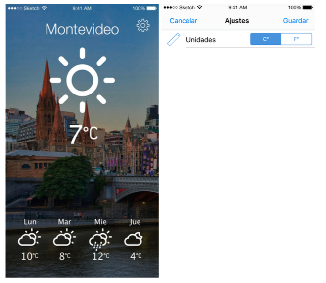
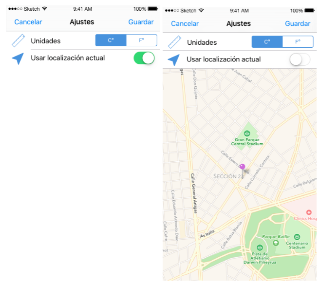

#Obligatorio 2

##Descripcion General

Este documento describe los requerimientos generales para la construcción de la app “UCU Weather”, la cual plantea un concepto simple y amigable para la consulta del pronóstico del clima en una ciudad dada.
La vista principal de la app “main” mostrará al usuario el clima actual de la ciudad seleccionada y el pronóstico para los siguientes 6 días. También cuenta con una vista de “settings”.
La app debe correr en iPhone con iOS 8.4 o superior, soportando solo la orientación portrait.

##Requerimientos

###Etapa 1

Cuando el usuario corre la app por primera vez se solicitan permisos para acceder a su geolocalización (por simplicidad se asume que el usuario siempre accede a esta petición). La geolocalización del usuario deberá refrescarse cada vez que el usuario despliegue la vista main y el pronostico actualizado en base a dicha geolocalización.

La vista main muestra el pronóstico actual y el de los siguientes 6 días, y da la opción de navegar a la vista de settings, donde el usuario podrá cambiar las unidades de medida entre sistema métrico e imperial, representados los los simbolos de grados celsius y fahrenheit. Por defecto la unidad de medida estara presentada en sistema metrico. El estado de las settings se deberá persistir, de manera que el usuario no pierda dichos valores hasta no desinstalar la app.

En la vista main se muestra el nombre de la ciudad de la que se está mostrando el pronóstico del clima, dicho nombre tendrá que obtenerse a partir la geolocalización usada para consultar la API.

###Etapa 2

En una segunda etapa (dentro del alcance de este obligatorio, pero como un agregado luego de tener la parte anterior completa) en la pantalla de settings se agregara la posibilidad de seleccionar el uso de la geolocalización actual o de una geolocalización seleccionada en un mapa.

##Criterio de evaluación

El obligatorio se evaluará durante la defensa, en la misma se analizará la completitud del obligatorio y la nota resultante se ponderará en función de las respuesta del alumno a preguntas vinculadas a la realización del obligatorio. Cada alumno tiene una nota individual dependiendo de la calidad de la defensa. Para la evaluación se tendrá en cuenta cualidad como: el correcto funcionamiento de la app, el buen uso de las abstracciones de UIKit, la calidad del código, el seguimiento del diseño y la utilización correcta del MVC y el manejo de errores.  **Se espera que el código y comentarios esten en ingles.**

Para consultar el pronóstico del clima se pide usar el servicio openweathermap.org, el mismo expone una API REST que debera ser consultada usando Alamofire. Si bien se alienta el uso bibliotecas open source, en este caso se restringe la implementación de las consultas a esta API al uso de Alamofire sin ninguna otra capa de abstracción (si se pueden usar para mapeo de objetos con JSON).

La Etapa 1 tiene una nota máxima de 90 puntos y la etapa 2 una nota máxima de 10 puntos..

